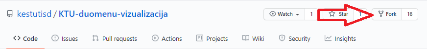
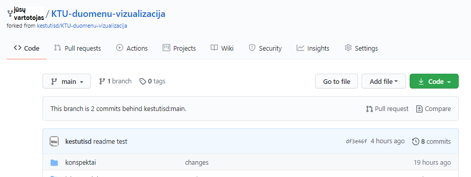
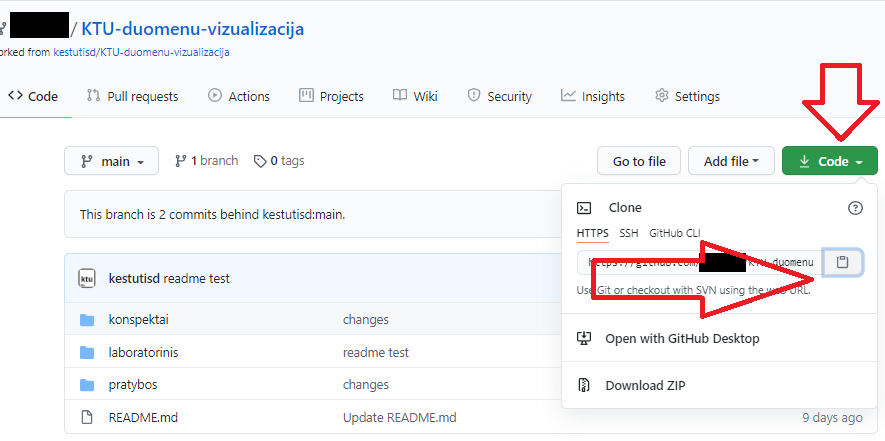
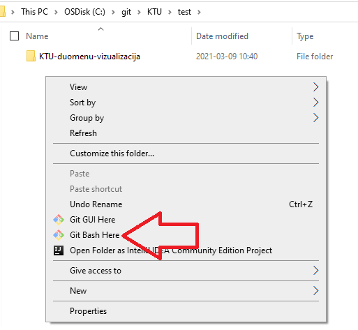

1. Instaliuojame git klientą ( https://git-scm.com/download/win )
2. Prisijungiame į github.com su savo vartotoju
3. Paspaudžiame "Fork" https://github.com/kestutisd/KTU-duomenu-vizualizacija repositorijoje



4. Repositorijos kopija atkeliauja pas jus


5. Nusikopijuokite Jūsų repositorijos nuorodą



6. Atsidarykite *git bash* Jūsų darbinėje direktorijoje:



7. Įveskite komandą:

```
git clone https://github.com/<JŪSŲ REPO>/KTU-duomenu-vizualizacija.git
```

8. Užeikite į repositorijos direktoriją (change directory):

```
cd KTU-duomenu-vizualizacija
```

9. Pakeitus failus lokaliai ir norint juos patalpinti į GitHub:

```
git add .
git commit -m 'pakeitimo aprasymas'
git push
```

Jei Windows automatiškai nesusies Jūsų prisijungimo vardo, įveskite šias komandas:

```
git config --global user.name "JŪSŲ_VARTOTOJAS"
git config --global user.email JŪSŲ_EMAIL@example.com
```

Daugiau informacijos apie git CLI čia:  https://www.computerhope.com/issues/ch001927.htm