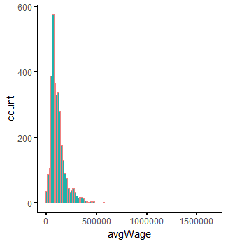
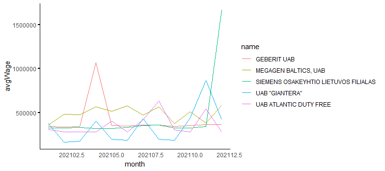
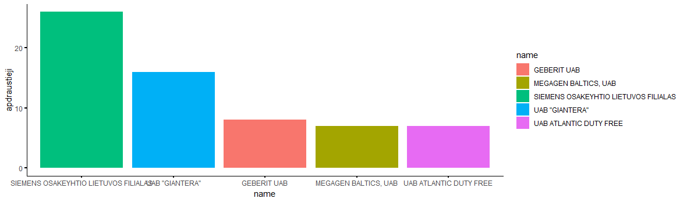
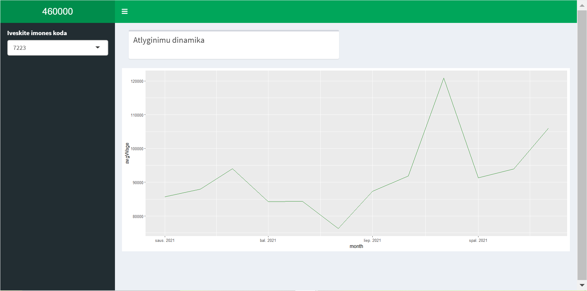

# R Laboratorinis darbas: duomenų vizualizacija

| Variantas | ecoActCode |
|------------- | ------------- |
|16   | 460000 |

### 1. Užduotis

Atsakymas:

Išvados: Kuo įmonės atlyginimas didesnis, tuo dažnis mažesnis.

### 2. Užduotis

Atsakymas:

Išvados: Visus metus įmonės SIEMENS OSAKEYHTIO LIETUVOS FILIALAS atlyginimas nesiekė 500000 ir laikėsi stabiliai, tačiau 11 mėnesį smarkiai išaugo ir stabiliai kilo (12 mėnesį viršijo 15000000 ribą). Intervale tarp antro ir penkto mėnesių UAB ATLANTIC DUTY FREE vidutinis atlyginimas smarkiai išaugo (viršijo 1000000) ir vėl krito iki ankstesnės atlyginimo sumos. Kitų įmonių atlyginimai laikėsi stabiliai -  vidutinio darbo užmokesčio kitimo dinamika 2021 metais panaši.

### 3. Užduotis

Atsakymas:

Išvados: Apdraustų darbuotojų skaičiumi skiriasi įmonės SIEMENS OSAKEYHTIO LIETUVOS FILIALAS (viršija 20 darbuotojų ribą) ir UAB GIANTERA (viršiją 10 darbuotojų). Kitų įmonių apdraustų darbuotojų skaičius panašus - nesiekia 10.

### 4. Užduotis

Shiny R aplikacijos nuotrauka:

